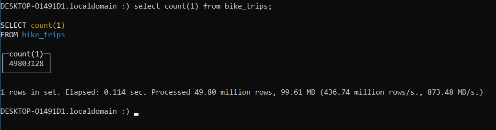
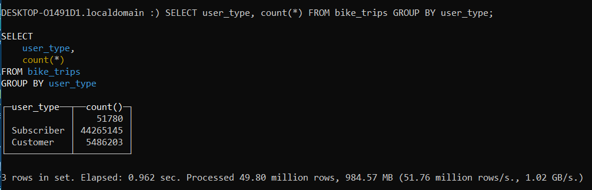

+++
title = "Loading 50 Million Citibike Trips into Clickhouse on WSL"
subtitle = "All on a Dell G7:rocket:"

date = 2019-01-20T00:00:00
lastmod = 2019-01-20T00:00:00
draft = false

# Authors. Comma separated list, e.g. `["Bob Smith", "David Jones"]`.
authors = ['Fausto Lopez']

tags = ["Academic"]
summary = "A quick tutorial on loading citibike data into a clickhouse database."

# Projects (optional).
#   Associate this post with one or more of your projects.
#   Simply enter your project's folder or file name without extension.
#   E.g. `projects = ["deep-learning"]` references 
#   `content/project/deep-learning/index.md`.
#   Otherwise, set `projects = []`.
# projects = ["internal-project"]

# Featured image
# To use, add an image named `featured.jpg/png` to your project's folder. 
[image]
  # Caption (optional)
  caption = ""

  # Focal point (optional)
  # Options: Smart, Center, TopLeft, Top, TopRight, Left, Right, BottomLeft, Bottom, BottomRight
  focal_point = ""

  # Show image only in page previews?
  preview_only = false

# Set captions for image gallery.
+++

## The Objective

A little while ago I had covered how to load tlc trip records into clickhouse under WSL (Windows subsystems for Linux), on the idea that it could be useful for teams working behind microsoft systems. After working with clickhouse for some time, I've come to love how easy it is to use and how powerful the database technology is. For some time I've been toying with the idea of building out a multi-platform transportation app (doesn't everyone) if anything to work on how I can integrate different data sets and practice some app construction. 

## Get the Data

When it comes to large data sets, citibike data is probably the next big thing after taxis so I figured I'd load that into clickhouse. I went ahead and cloned [Todd Schneider's repo](https://github.com/toddwschneider/nyc-citibike-data); as a transportation guru he has both citibike and taxi repos holding ETL processes in postgresql. You'll want to run the following to get the program running:

```
git clone https://github.com/toddwschneider/nyc-citibike-data.git
cd nyc-citibike-data
./download_raw_data.sh
./initialize_database.sh && ./import_trips.sh
```

This shouldn't take too long, took about an hour for me to download everything and another hour for it to process. Once the data is in postgres you will want to extract .gz files, which are highly compressed and will be loaded into clickhouse. Under Todd's schema you'll see he creates a view with combine trip and geographical information:

```sql
CREATE VIEW trips_and_stations AS (
  SELECT
    t.*,
    ss.name AS start_station_name,
    ss.latitude AS start_station_latitude,
    ss.longitude AS start_station_longitude,
    ss.nyct2010_gid AS start_nyct2010_gid,
    ss.boroname AS start_boroname,
    ss.ntacode AS start_ntacode,
    ss.ntaname AS start_ntaname,
    ss.taxi_zone_gid AS start_taxi_zone_gid,
    ss.taxi_zone_name AS start_taxi_zone_name,
    es.name AS end_station_name,
    es.latitude AS end_station_latitude,
    es.longitude AS end_station_longitude,
    es.nyct2010_gid AS end_nyct2010_gid,
    es.boroname AS end_boroname,
    es.ntacode AS end_ntacode,
    es.ntaname AS end_ntaname,
    es.taxi_zone_gid AS end_taxi_zone_gid,
    es.taxi_zone_name AS end_taxi_zone_name
  FROM trips t
    INNER JOIN stations ss ON t.start_station_id = ss.id
    INNER JOIN stations es ON t.end_station_id = es.id
);
```
We will want to pull more data than this table however, because we want to include weather data in our main table. You'll want to run a left join against weather observations when pulling from postgres. But first, we will need to create a directory to pull the data and then provide the write permissions to write to that directory:

```
mkdir -p /mnt/c/Users/yourcompname/nyc-citibike-data/trips
$ sudo chown -R postgres:postgres \
    /home/yourcompname/nyc-citibike-data/trips
```
Now we can use copy to pull the data, I split the files into million chunk files:

```sql
COPY (
SELECT
ts.trip_duration,
ts.start_time,
ts.stop_time,
ts.start_station_id,
ts.start_station_name,
ts.start_station_latitude,
ts.start_station_longitude,
ts.end_station_id,
ts.end_station_name,
ts.end_station_latitude,
ts.end_station_longitude,
ts.bike_id,
ts.user_type,
ts.birth_year,
ts.gender, 
ts.start_nyct2010_gid,
ts.start_boroname,
ts.start_ntacode,
ts.start_ntaname,
ts.start_taxi_zone_gid,
ts.start_taxi_zone_name,
ts.end_nyct2010_gid,
ts.end_boroname,
ts.end_ntacode,
ts.end_ntaname,
ts.end_taxi_zone_gid,
ts.end_taxi_zone_name,
weather.precipitation rain,
weather.snow_depth,
weather.snowfall,
weather.max_temperature max_temp,
weather.min_temperature min_temp,
weather.average_wind_speed
FROM trips_and_stations as ts 
    LEFT JOIN central_park_weather_observations weather
        ON weather.date = ts.start_time::date
) TO PROGRAM
    'split -l 10000000 --filter="gzip > /mnt/c/Users/yourcompname/Documents/nyc-citibike-data/trips/trips_\$FILE.csv.gz"' WITH CSV;

```
This will run in approximatel 15-30 mintues depending on your computer resources. 

## Loading the Data into Clickhouse

Once you have the files in place, you'll want to start up clickhouse. If you need to review how to set it up you can check out my previous [post](https://www.faustolopez.com/post/a-billion-taxi-rides-in-clickhouse-wsl-on-a-dell-g7/). Once you're all set, start your server and client:

```
sudo service clickhouse-server start
clickhouse client
```

Once in the client create your bike_trips table:

```sql
CREATE TABLE bike_trips (
trip_duration Nullable(Float64),
start_time Nullable(DateTime),
stop_time Nullable(DateTime),
start_station_id Nullable(String),
start_station_name Nullable(String),
start_station_latitude Nullable(Float64),
start_station_longitude Nullable(Float64),
end_station_id Nullable(String),
end_station_name Nullable(String),
end_station_latitude Nullable(Float64),
end_station_longitude Nullable(Float64),
bike_id Nullable(UInt8),
user_type Nullable(String),
birth_year Nullable(UInt8),
gender Nullable(String),
start_nyct2010_gid Nullable(Int8),
start_boroname Nullable(String),
start_ntacode Nullable(String),
start_ntaname Nullable(String),
start_taxi_zone_gid Nullable(Int8),
start_taxi_zone_name Nullable(String),
end_nyct2010_gid Nullable(Int8),
end_boroname Nullable(String), 
end_ntacode Nullable(String),
end_ntaname Nullable(String),
end_taxi_zone_gid Nullable(Int8),
end_taxi_zone_name Nullable(String),
rain Nullable(Float64),
snow_depth Nullable(Float64),
snowfall Nullable(Float64),
max_temp Nullable(Float64),
min_temp Nullable(Float64),
average_wind_speed Nullable(Float64)
) ENGINE = Log;
```
You may wonder why some fields that could be integers or float64 are changed to string. I decided to do this to get the data in quick, opting to optimize and tune later. In order to clean out some of the NULL data I borrowed Mark's cleaning [script](https://tech.marksblogg.com/billion-nyc-taxi-clickhouse.html) he employs with the taxi data in clickhouse. You'll want to log out of clickhouse client and back in terminal run the following:

```
cd /mnt/c/Users/yourcompname/Documents/nyc-citibike-data/trips/
time (for filename in /mnt/c/Users/0000/Documents/nyc-citibike-data/trips/trips_x*.csv.gz; do
            gunzip -c $filename | \
                python trans.py | \
                clickhouse-client \
                    --query="INSERT INTO bike_trips FORMAT CSV"
        done)
```
Data should load rather quickly, the whole process took me about an hour. At the moment the script kicks and error at the very end, some dirty data that needs to be cleaned but I'll get to that another time. Either way, log back into clickhouse client and run a few quick codes:

```
SELECT COUNT(1) FROM bike_trips;
```


```
SELECT user_type, count(*) FROM bike_trips GROUP BY user_type;
```


And that's it, quick simple and incredibly powerful, lightning fast results perfect for analytics. Enjoy!