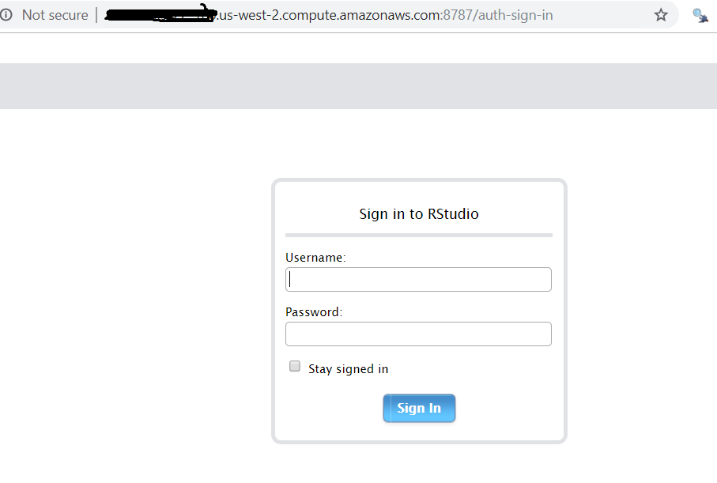
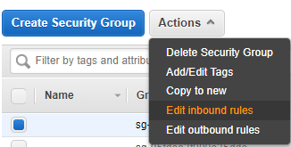

+++
title = "Setting up a Shiny Server on AWS EC2"
subtitle = "Host your own shiny apps :rocket:"

date = 2018-07-01T00:00:00
lastmod = 2018-07-01T00:00:00
draft = false

# Authors. Comma separated list, e.g. `["Bob Smith", "David Jones"]`.
authors = ['Fausto Lopez']

tags = ["Academic"]
summary = "Spinning up a spark cluster in AWS."

# Projects (optional).
#   Associate this post with one or more of your projects.
#   Simply enter your project's folder or file name without extension.
#   E.g. `projects = ["deep-learning"]` references 
#   `content/project/deep-learning/index.md`.
#   Otherwise, set `projects = []`.
# projects = ["internal-project"]

# Featured image
# To use, add an image named `featured.jpg/png` to your project's folder. 
[image]
  # Caption (optional)
  caption = "Image credit: [**Unsplash**](https://unsplash.com/photos/CpkOjOcXdUY)"

  # Focal point (optional)
  # Options: Smart, Center, TopLeft, Top, TopRight, Left, Right, BottomLeft, Bottom, BottomRight
  focal_point = ""

  # Show image only in page previews?
  preview_only = false

# Set captions for image gallery.
+++

# Why Shiny?

When I started working at TLC I wanted to use R's Shiny package to help develop some quick and easy to use dashboards that would streamline my work flow and automate a lot of data analytics for the team. At the the time I built a few for internal use, but getting them to run across the agency was difficult; the only package known for local install was [RInno](https://ficonsulting.github.io/RInno/) and admin priveleges for this sort of mucking around was frowned upon. The powers at be were not inclined to utilize shiny as they saw it as an open source security issue and so we resolved to use Tableau. I still released a dashboard for public use using shiny.io but that was limited to public data.

Recently the team has been running into limitations with tableau and myself and some of my creative staff are working with shiny apps as they offer more flexibility and are just more fun to make. As a result I've been toying with the idea of setting up our own shiny server infrastructure, and since it's also been something on my own personal to-do list, I figured why not (I had done this with a raspberry pi before albeit for fun). Whatever I learn I can use for my own app development and later scale it to the workplace. But wait, why shiny and not flask or django? Well aside from the existing work we are already doing, I think shiny makes for easier development with decent room for scaling, it's free and has a vibrant community as with all things R. As useful as python is for some of my other work, R's just easier in my opinion, just think about the last time you needed to install a package in R vs. Python at work!?

I went through this process on EC2 but there are a lot of tutorials on how to do this on digital ocean as well as on EC2. I used the following sources in combination for my install process:

[The great Dean Attali installs shiny server on digital ocean](https://deanattali.com/2015/05/09/setup-rstudio-shiny-server-digital-ocean/)

[The clever Catherine Ordun installs shiny server on aws EC2](https://tm3.ghost.io/2017/12/31/deploying-an-r-shiny-app-to-aws/)

# Setup on AWS

Another thing on the old to-do list was using AWS which I haven't used much, always defaulting to the rebel favorite digital ocean, and I thought I could go ahead and kill two birds with one stone so I decided to setup the shiny server on AWS ec2, something which ended up being a great decision as I've gotten much better with AWS since this process.

First you'll want to navigate to [free tier options](https://aws.amazon.com/free/) and choose the 750 hours of EC2 per month:


Next you'll want to choose your instance (make sure it says free, I chose 16.04 Ubuntu):


You'll be prompted to set up a key pair, if you've used AWS before you can go ahead and choose the key pair you already made or else you'll have to make your [own](https://docs.aws.amazon.com/AWSEC2/latest/UserGuide/ec2-key-pairs.html#having-ec2-create-your-key-pair). Once you move through the rest of the defaults you can launch your instance:


And you wait until you see it running:


## Connect to the your Instance

Connecting to your instance can be a headache if you haven't done it before. If you are just starting off then you will have to create a new one; as is often the case with Microsoft windows in programming and data, things are more difficult than MacOS or Linux. First download [putty](https://www.putty.org/), then you’ll want to create a key pair and convert that key pair with [puttygen](https://aws.amazon.com/premiumsupport/knowledge-center/convert-pem-file-into-ppk/). Now you can feed this converted pair into your puttygen app to connect. Note that when you finally get that terminal open, your login is ubuntu with no password.

# Install R

I like the idea of having a mobile rstudio option, so as Dean Attali does in his install procedure I went ahead and set that up as well. First I updated and added nginx:

```
sudo apt-get update
sudo apt-get -y install nginx
```

To test that this worked you can visit your ip address which will look something like http://ec2- . . . .com and you should see a welcoming from nginx. Dean points out when he tests this in digital ocean:

"The default file that is served is located at /var/www/html/index.nginx-debian.html, so if you want to change what that webpage is showing, just edit that file with sudo nano /var/www/html/index.nginx-debian.html. For example, I just put a bit of text redirecting to other pages in my index page. The configuration file is located at /etc/nginx/nginx.conf.

When you edit an HTML file, you will be able to see the changes immediately when you refresh the page, but if you make configuration changes, you need to restart nginx."

You can always manipulate nginx with:

```
sudo service nginx stop
sudo service nginx start
sudo service nginx restart
```
Next we can add R to the source list:

```
sudo sh -c 'echo "deb http://cran.rstudio.com/bin/linux/ubuntu xenial/" >> /etc/apt/sources.list
```

The above will install R 3.4, if you want 3.5 and above run:

```
sudo add-apt-repository 'deb https://cloud.r-project.org/bin/linux/ubuntu xenial-cran35/'
```

And add public keys:

```
gpg --keyserver keyserver.ubuntu.com --recv-key E084DAB9
gpg -a --export E084DAB9 | sudo apt-key add -
```
And install R:
```
sudo apt-get update
sudo apt-get -y install r-base
```
Go ahead and test R by running R and you should get the pop up window:


On EC2 I chose the free tier, which is the weakest machine with 1GB of ram. Dean points out that you can add 1GB of swap space to allow larger packages to be installed:

```
sudo /bin/dd if=/dev/zero of=/var/swap.1 bs=1M count=1024
sudo /sbin/mkswap /var/swap.1
sudo /sbin/swapon /var/swap.1
sudo sh -c 'echo "/var/swap.1 swap swap defaults 0 0 " >> /etc/fstab'
```

Once this is completed we install dependencies for R's devtools along with devtools and Shiny:

```
sudo apt-get -y install libcurl4-gnutls-dev libxml2-dev libssl-dev
sudo su - -c "R -e \"install.packages('devtools', repos='http://cran.rstudio.com/')\""
sudo su - -c "R -e \"devtools::install_github('daattali/shinyjs')\""
```

# Important: R Package Install!

In order to run certain packages across all users we can't just install in the local R instance you pull up. We will want to leverage root priveleges to install the packages globally. That's why above we run ```sudo su - -c``` in order to get that access.

# Installing Rstudio Server

Now that we have R installed we can install Rstudio server which you will be able to access from anywhere with a computer; start with the dependencies:

```
sudo apt-get -y install gdebi-core
```

Next grab the latest version of rstudio; note that you will have to swap the download link for the latest one on the [downloads page](https://www.rstudio.com/products/rstudio/download-server/):

```
wget https://download2.rstudio.org/rstudio-server-1.1.463-amd64.deb
sudo gdebi rstudio-server-1.1.463-amd64.deb
```

Before we access rstudio server we have to make sure that our EC2 security settings allow for connections. This is not the most secure way to do things, but at this moment I am just proving a concept. You'll want to navigate to your EC2 dashboard and then down to security groups. Once there locate the security group associated with your instance and edit the inbound rules:



This will open up a window where you can edit the port connections:


Here we are allowing a connection from anywhere to hit the relevant ports. You will add rules for port 8787, 3838 and 80 because we will use all these to access our server.

And now you should be able to access rstudio server in your browser with your ec2 address:


When I got here initially I was not sure how to login, as I had not created another user; the process in EC2 looked a little trickier and I was running into errors. My workaround was to create a password for the ubuntu un which is the default. Simply run:

```
sudo passwd ubuntu
```
Enter a password and you should be good to go. 

# Installing Shiny Server

We finally reach the main portion of this tutorial which is installing shiny server! You'll start by importing the shiny package needed to run shiny server an we will bring in the rmarkdown package as well since shiny server lets you run rmarkdown documents:

```
sudo su - -c "R -e \"install.packages('shiny', repos='http://cran.rstudio.com/')\""
sudo su - -c "R -e \"install.packages('rmarkdown', repos='http://cran.rstudio.com/')\""
```

Just like before you'll want to grab the latest version of [shiny server](https://www.rstudio.com/products/shiny/download-server/):

```
wget https://download3.rstudio.org/ubuntu-14.04/x86_64/shiny-server-1.5.9.923-amd64.deb
sudo gdebi shiny-server-1.5.9.923-amd64.deb
```

Shiny will let you know it's running:


Once this runs you will be able to hit your EC2 address again as with rstudio server but instead of 8787 as your port you will point the address to 3838 and you will get:


# Add write and read priveleges

```
sudo groupadd shiny-apps
sudo usermod -aG shiny-apps ubuntu
sudo usermod -aG shiny-apps shiny
cd /srv/shiny-server
sudo chown -R ubuntu:shiny-apps .
sudo chmod g+w .
sudo chmod g+s .
```

# Deploy a Shiny App using Git

More to come here as I update this post


# issues with rgdal

run:

sudo add-apt-repository -y ppa:ubuntugis/ubuntugis-unstable
sudo apt update
sudo apt install gdal-bin python-gdal python3-gdal libgdal1-dev
sudo apt-get install libudunits2-dev libgdal-dev libgeos-dev libproj-dev
install.packages("rgdal")


